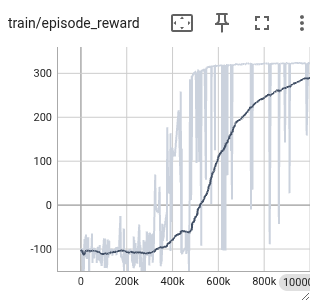
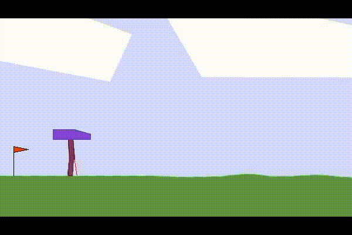
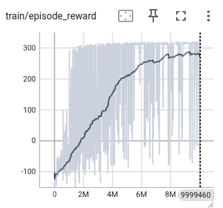
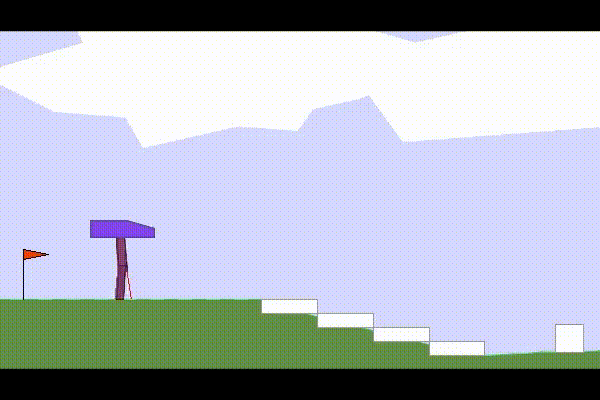
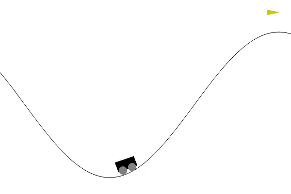

# Reinforcement Learning On Bipedal Walker


* DDPG: Deep Deterministic Policy Gradient 
  * https://arxiv.org/abs/1509.02971
* SAC: Soft Actor Critic
  * https://arxiv.org/abs/1801.01290
* FORK: Foward Looking
  * https://arxiv.org/abs/2010.01652

Env: `BipedalWalker-v3`, and its `BipedalWalkerHardcore-v3` variant (much harder).

## Result
#### DDPG
DDPG lacks the exploration capacity, thus it takes several runs to achieve the learning curve that is on the right trajectory.


#### SAC (Easy)
SAC augments DDPG with entropy term in the score thus it can achieve learning the non-hardcore environment within single run. But it lacks the capacity to learn the hardcore environment, mainly because it lacks the ability to handle the big stump obstacle which requires more forward looking planning.





#### SAC-FORK (Hardcore)
SAC-FORK augments SAC by adding forward looking term. This allwos it to achieve learning the hardcore environment after ~10M steps.





## Batchsize
Note: `Small batch deep reinforcement learning` [1509.02971](https://arxiv.org/abs/1509.02971), suggests a smaller batch size of 16, but my observation does not align with it.

## Mountain Car
Mountain Car is hard because the agent must perform a long sequence of seemingly counterproductive actions—moving away from the goal to build enough momentum—before receiving the sparse reward at the top of the hill.



(See how the agent laerns to minimizes the car movement to avoid penalty just from moving).

* RND: Random Network Distillation
  * https://arxiv.org/abs/1810.12894

Exploratory algorithms like SAC and RND fail to solve the Mountain Car problem because they rewards novel states rather than goal-directed progress. In other words, they drive curiosity but not purposeful momentum accumulation.

## Environments

* Pytorch >= 2.5.1

## Profiling
`train_sac.py` has profiling implemented. After running with `--profile` flag, run
```
$ snakeviz profiles/training_profile.prof
$ tensorboard --logdir=./profiles/torch_profilerer
```

