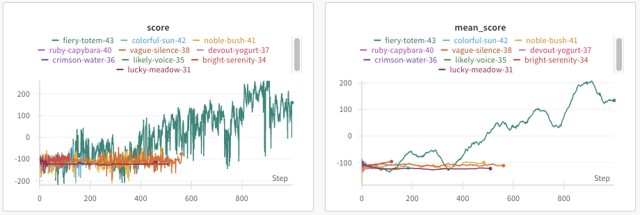
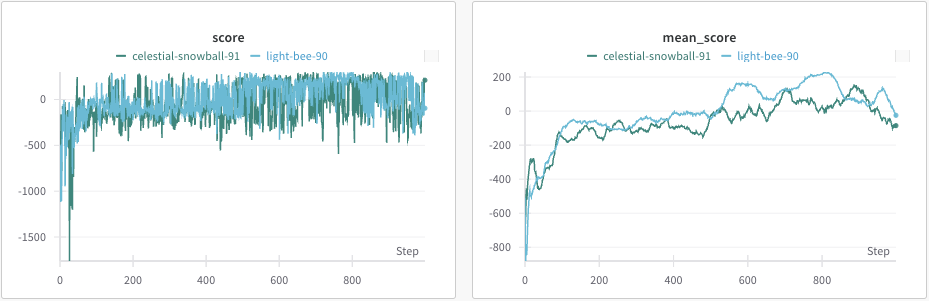

# DUPG - Improved DDPG

DDPG = Deep Deterministic Policy Gradient

DUPG = Deep Undeterministic Policy Gradient

This is an implementation of [DDPG](https://arxiv.org/abs/1509.02971) paper.

## Improvement

An improvement has been made here to the sigma of the noise to decay to mimic the DQN's eta idea.

The original DDPG fixes the sigma valuea at constant 0.20.
My change promote this to larer, 0.50 value while allowing it to decay to promote exploitation after the initial exploration phase.
This results in the significantly improved learning curve for `BipedalWalker-v3` envrionment.
Without this, the walker end up with not learning effective moves.

For `BipedalWalker-v3` env,

(The mean score on right is the mean over the recent 50 epochs).

The lines with low values which do not improve over time use the constant 0.20 sigma value.
The green one which improves over time use the idea of decaying sigma.

The improvement is pronouced in `BipedalWalker-v3` environment but unlikely in all environment, `LunarLander-v3` performs well without the sigma decay, though the sigma decay present some (relatively lesser) degree of improvement.

For `LunarLander-v3` env,

(green: original, cyan: decaying sigma)

## Example - DDPG vs. DUPG
DDPG

Note that this type of jump-once-and-not-doing-anything-aferwards move happens repeated over episodes, suggesting the weekness in the exploration behavior.

DUPG

## Batchsize
As suggested in `Small batch deep reinforcement learning` [1509.02971](https://arxiv.org/abs/1509.02971), a smaller batch size of 16 was used, instead of the 64 which the original paper proposed.

## Environments

* Pytorch 2.5.1
