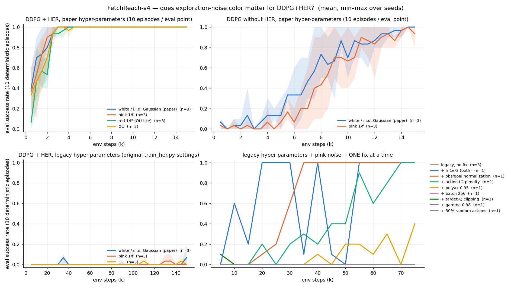

# Reinforcement Learning On Bipedal Walker

* DDPG: Deep Deterministic Policy Gradient 
  * https://arxiv.org/abs/1509.02971
* SAC: Soft Actor Critic
  * https://arxiv.org/abs/1801.01290
* FORK: Foward Looking
  * https://arxiv.org/abs/2010.01652
* CN = Colored (Pink) Noise exploration
  * https://arxiv.org/abs/2206.05403

Env: `BipedalWalker-v3`, and its `BipedalWalkerHardcore-v3` variant (much harder).

## Result
#### DDPG
DDPG lacks the exploration capacity, thus it takes several runs to achieve the learning curve that is on the right trajectory.


#### SAC (Easy)
SAC augments DDPG with entropy term in the score thus it can achieve learning the non-hardcore environment within single run. But it lacks the capacity to learn the hardcore environment, mainly because it lacks the ability to handle the big stump obstacle which requires more forward looking planning.


#### SAC-FORK (Hardcore)
SAC-FORK augments SAC by adding forward looking term. This allwos it to achieve learning the hardcore environment after ~10M steps.


## MountainCarContinuous-v0 (sparse reward)

Plain SAC and SAC-FORK both fail here (evaluated at -0.3 and -67 respectively): the
action penalty makes "do nothing" a stable local optimum, and per-step i.i.d. Gaussian
noise is a random walk in torque that never builds the momentum needed to reach the goal.

SAC-CN (`sac/agent_cn.py`) keeps the SAC update rules unchanged and only replaces the
exploration noise with a temporally correlated 1/f^beta (pink, beta=1) sequence per
episode, following "Pink Noise Is All You Need" (Eberhard et al., ICLR 2023). The
correlated torques produce coherent rocking behavior: the very first exploration episode
already reaches the goal.

Result: **94.7 +/- 0.4 average over 100 deterministic eval episodes** (solved bar: 90),
goal reached in ~70 steps, after ~300k env steps (~13 min wall clock).

```
$ python train_sac.py --config-name=train_cn_mountain_car.yaml
$ python test_sac.py --config-name=test_cn_mountain_car.yaml
```

`noise_beta: 0` in `configs_sac/agent/sac_cn_mountain_car.yaml` recovers plain SAC;
`2.0` gives OU-like red noise.

Note: gymnasium >= 1.0 vector envs auto-reset in "next step" mode; the training loop
skips the bookkeeping transition at episode boundaries and bootstraps through time-limit
truncations (done flag = terminated only).

## FetchReach (sparse, goal-conditioned): DDPG + HER, and does pink noise matter?

* HER: Hindsight Experience Replay
  * https://arxiv.org/abs/1707.01495

Question asked: my earlier HER attempt on FetchReach failed; the reward is a rare
on/off signal, so is HER alone not enough — was pink-noise exploration the missing piece?

Answer: **no**. On FetchReach the color of the exploration noise is irrelevant; what was
missing was a paper-faithful DDPG (input normalization, lr 1e-3, action-L2 penalty,
polyak 0.95, ...). `her/` is a clean DDPG+HER implementation (baselines-HER hyper-parameters,
`future` relabelling with k=4 at sample time) with pluggable exploration noise
(`--noise white|pink|red|ou`, colored noise from `sac/noise.py`).



Findings (3 seeds each, eval = 10 deterministic episodes; a random policy already touches
the goal in ~18% of episodes, so exploration is not the bottleneck on this task):

* **Paper hyper-parameters + HER solve it in 2-5k env steps for every noise color** (white,
  pink, red, OU); pink is indistinguishable from white. 100 %/100 % over 100 test episodes.
* **Without HER** the same DDPG still solves it, just ~4x slower (100 % by ~15k steps),
  as reported by Plappert et al. 2018 — FetchReach is the easy Fetch task.
* **Legacy hyper-parameters (the old `train_her.py`: lr_actor 1e-5, tau 0.001, no
  normalization, no action penalty) stay at 0 % for 150k steps with every noise color,
  pink included.** Adding a single fix on top of them: obs/goal normalization -> 100 %,
  lr 1e-3 -> 100 % (unstable), action-L2 -> ~90 %; while more exploration (30 % random
  actions), target-Q clipping, batch size, gamma do nothing. The old code also dropped the
  goal from the network input during learning (see git history of `ddpg/agent.py`), which
  makes HER relabelling meaningless by construction.

Take-away: pink noise helps when the *behaviour* needed to ever see reward is temporally
extended (MountainCar rocking); FetchReach fails for optimisation reasons, so it does not.

```
$ python train_her.py --noise white            # paper setup
$ python train_her.py --noise pink             # pink-noise exploration
$ python train_her.py --noise white --no-her   # plain DDPG
$ python train_her.py --preset legacy --noise pink --set normalize=True   # single-fix ablation
$ python test_her.py --ckpt checkpoints/her_paper_white_her_seed0.pt [--render]
$ python her/plot_results.py                   # regenerates the figure from exp_her/*.csv
```

## Batchsize
Note: `Small batch deep reinforcement learning` [1509.02971](https://arxiv.org/abs/1509.02971), suggests a smaller batch size of 16, but my observation does not align with it.

## Mountain Car
Mountain Car is hard because the agent must perform a long sequence of seemingly counterproductive actions—moving away from the goal to build enough momentum—before receiving the sparse reward at the top of the hill.


(See how the agent learns to minimize the car movement to avoid the penalty that comes just from moving).

* RND: Random Network Distillation
  * https://arxiv.org/abs/1810.12894

Exploratory algorithms like SAC and RND fail to solve the Mountain Car problem because they rewards novel states rather than goal-directed progress. In other words, they drive curiosity but not purposeful momentum accumulation.

#### SAC-CN (solved)
SAC with pink-noise exploration (see the MountainCarContinuous section above) solves it:
the temporally correlated noise produces the coherent rocking that builds momentum. The
trained agent reaches the flag in ~70 steps, scoring ~95 per episode.


## Environments

* Pytorch >= 2.5.1

## Profiling
`train_sac.py` has profiling implemented. After running with `--profile` flag, run
```
$ snakeviz profiles/training_profile.prof
$ tensorboard --logdir=./profiles/torch_profilerer
```

